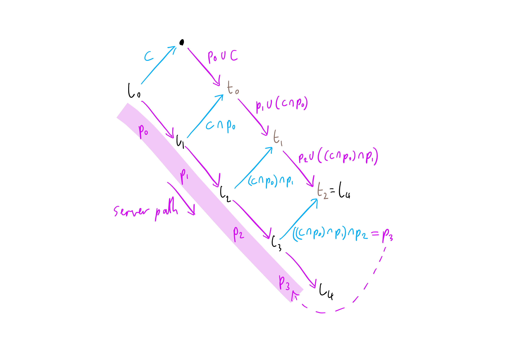
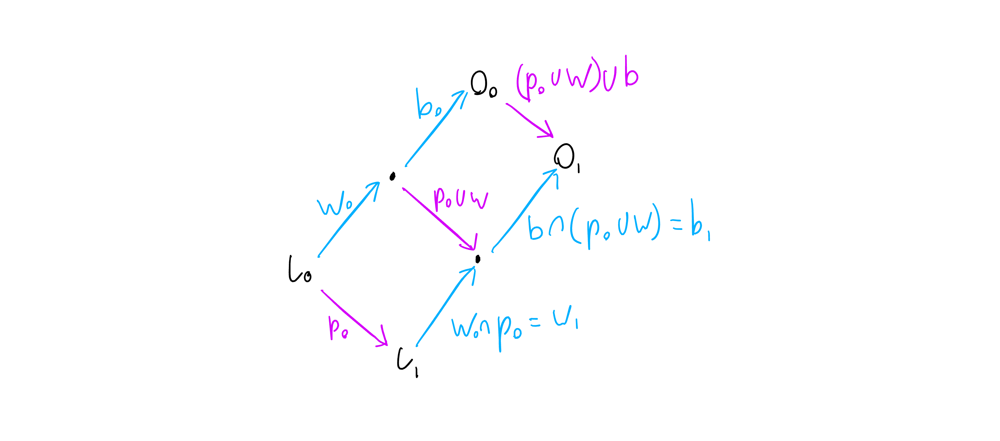

### Introduction

[Operational transformation](https://en.wikipedia.org/wiki/Operational_transformation) is a technique for handling concurrent editing of shared data. This is very often a list (for example a `String` as a `List[Char]`, or a text document with a list-like structure).

This entry is intended to describe the fundamentals of one operational transformation approach, applied to list data, in a server-client system. This is the approach implemented in [tree-react](https://github.com/trepidacious/tree-react/tree/master/tree-ot). 

There are a good number of articles already available describing the detailed theoretical basis of OT, or comparing the advantages and disadvantages of existing techniques, but there seems to be a lack of information on actually implementing such a system in a practical way - hopefully this will fill in some of the gaps.

### Operations

The core of the approach is to allow a sequence of operations to be reordered, by transforming those operations as necessary so that they have the same effect after the reordering and transformation.

A common way to represent an operation on lists is by building up an "edit" from "atoms" of three types:

1. `Retain(n)` - This is somewhat boring, it just represents leaving the next `n` items alone - this is analogous to moving a cursor along by `n` items in the list.
2. `Insert(s)` - This inserts the list `s` at the current position.
3. `Delete(n)` - This deletes `n` items from the list at the current position.

An operation is just a list of these atoms.

So for example we could edit the string "Hello!" using an operation containing `List(Retain(5), Insert(" World"), Delete(1))`. This would produce "Hello World". This nicely mirrors how we edit text naturally.

When we consider concurrent operations (for example on different clients connected to a server, with all the problems of latency), we can see the need for transformation of operations - say another client decides to apply an operation `List(Insert("Oh "), Retain(6))`. This would be applied to "Hello!" to produce "Oh Hello!". 

If we then tried to apply our original operation on this modified list, we would find that the preceding insertion has messed up our expected positions in the string - we would instead produce "Oh He Worldlo!", which while great is not what we wanted. We will address this by transforming the operations to account for changes in the list made by preceding operations.

In the following description, we will often say that an operation is intended to be implied "at" or "on" a particular state of the data, or after another operation. Operational transformation allows us to take an operation intended to be applied at one state of the data, and transform it into a new operation that can be applied at another state of the data. This is a little like a git rebase - we can for example use operational transformation to move some pending edits from an older "revision" of our data to a newer one.

### Transformations

We'll perform transformations using a single function:

```scala
def transform(a: Operation, b: Operation): (Operation, Operation)
```

This takes a pair of operations `a` and `b`, and provides a new pair of operations `(ap, bp)`. The idea is that if client A has applied operation `a`, and client B has applied operation `b`, we need to bring them back to the same end result. `bp` can be applied on client A, after `a`, and `ap` will be applied on client B, after `b`. The requirements that the clients have the same list after this is equivalent to:

```scala
ap(b(l)) == bp(a(l))    // for any List l
```

Here we represent applying operation `a` to list `l` as `a(l)`.

In addition, `ap` should "preserve the intent" of `a` when it is applied after `b`. In other words it should "do what the user intended" when they made the edit that produced `a`. Looking at our example earlier, we can say that the "intent" of our first operation is to insert " World" after "Hello", and then delete the exclamation mark. So when we apply this to "Oh Hello!" we would expect to get "Oh Hello World". If we transform the operations and try this (with a correct algorithm), this is indeed what we will get.

The actual implementation of `transform` is a little fiddly - see [Operation](https://github.com/trepidacious/tree-react/blob/master/tree-ot/shared/src/main/scala/org/rebeam/tree/ot/Operation.scala) for the `tree-react` implementation.

In our example earlier we considered two clients running in parallel and talking to each other. While OT can be used for peer to peer networks like this, we will instead be looking at a standard client-server arrangement:

1. One server
2. Multiple clients running in parallel
3. Communication via messages. We assume the messages are reliably transmitted and received in order, but we have significant latency (for example tcp/ip or websockets).

This leads to the next level of an OT system - using the properties of the transform function to build a system that can synchronise multiple clients.

### "After" operators

To make the description of transformations more compact and intuitive, we will introduce two new operators - these are both derived from the transform function. We can show these in a "state space" diagram:


Here we have the initial state of a list as `l0` on the left hand side. We show each operation as an arrow, which edits the list to produce a new one. Operation `a` is shown in blue and `b` in pink. These operations, when applied to `l0`, produce different results (the top and bottom dots in the diagram). To bring these back together, we use the transformed operations `ap` (shown as "a" with a dash in the diagram) and `bp`. `ap` applied to the bottom state brings us to a new state `l1` combining the effect of operations `a` and `b`. `bp` applied to the bottom state produces exactly the same new state `l1`. So far this is all as described earlier.

One important note before continuing is that in the `transform` function, the operations `a` and `b` are treated slightly differently - in general `transform(a, b)._1 != transform(b, a)._2`. In the case where operations `a` and `b` attempt to insert different items at the same index, we need to decide which takes priority - i.e. which is applied first, from the point of view of the transformation. This is done arbitrarily, by applying the left hand operation first. In the following diagrams and transformations, we will always make operations that are applied on the server use the left hand parameter of the transform function, so they will take priority. In diagrams, we will show the lower priority client operations as a blue arrow going up and to the right, and higher priority server operations as a pink arrow going down and to the right. This approach works fairly well, but can lead to concurrent operations from two clients being "interleaved" rather than having one client consistently "win" and go first. To address this we can just add a priority to each operation, and use this as the tie breaker. When doing this, we need to make sure that when we transform an operation, the transformed version inherits the priority of the original operation. When we compose operations, they should always have the same priority, and produce a composed operation with the same priority. The priority is arbitrary, but must be different for each client - this can be achieved by using the order in which the clients connected to the server - e.g. later connection gives higher priority.

The new operators are represented as `∪` and `∩` - we've stolen these symbols because `∪` looks like it is pointing down, for a server operation that is shown as a downwards arrow in diagrams, and `∩` points up for a client operation. They both represent transforming the operation on the left hand side so it occurs after the one on the right, hence naming them "after". So `a ∪ b` means "a transformed to apply after b", and because the symbol points down, we are further saying that `a` is a server operation (and so `b` is a client operation). This operator is equivalent to `transform(a, b)._1`. Similarly `a ∩ b` means "a transformed to apply after b, where a is a client operation", and is equivalent to `transform(b, a)._2`.

Going back to the diagram we can see that `bp` is "b after a", and `ap` is "a after b":


We can now use these "diamond" diagrams and the after operators to produce the compound transformations we need to keep a server and multiple clients synchronised.

### Server-side transformations

In the server-client system we use, we will follow the approach used by the ill-fated [Google Wave](https://en.wikipedia.org/wiki/Apache_Wave) product, hopefully with happier results.

This uses a simpler pattern of communication than some other OT implementations, allowing for easier implementation and using fewer server resources, with only a minor drawback (we will get to this later). The simplification we will achieve is that the server will have a simple, linear sequence of data states (list values), which we will label as `l0`, `l1` etc. We refer to the index as the revision of the data (revision 0, revision 1 etc.). This also leads to a simple linear history of operations - the server will store the list of operations used to produce the states - `p0` will be applied to `l0` to produce `l1`, and so on. These are used to synchronise with the clients when they are out of date (i.e. operating from an older revision than the current one.)

Let's start from a simple situation with the server and a single client. The client will:

1. Receive an initial state of the data on first connection to the server.
2. Send an operation to the server represent the first edit. This becomes the "waiting" operation.
3. Accumulate additional edits if necessary until step 4 occurs. A single operation can represent an arbitrary set of user edits, so we can accumulate into one operation, which we call the "buffer"
4. Receive a confirmation of the waiting operation. Apply the waiting operation to the current state of the data to produce a new state. Send the buffer operation to the server, so that it becomes the new waiting operation.
5. Repeat from 3.

So we have a "ping-pong" communication system, where the client "batches" edits together and sends them as a single operation each time it receives a confirmation from the server. This makes the drawback of the system clear - the server will receive batches of edits from each client, at a rate determined by the round-trip latency to that client. Other clients will see these edits in batches too, so other user's editing will appear less smooth (depending on latency).

The advantage of this system is that whenever the client sends an edit to the server, it does so based on a known server data state - the one produced by applying the client's previous (waiting) operation. In more complex OT implementations the client does not wait to send operations, and as a result it will at some times be sending operations that are applied to a data state that never occurs on the server - the server will then need to model the client state to apply operations correctly, and this requires additional complexity and storage of a model of each client on the server, leading to increased storage requirements compared to our simple linear server history.

At this point we have enough detail to see what is required on the server.

If the server really were connected to only one client, the situation would be quite boring:

1. Server receives a client operation
2. Server applies the operation to its data state to produce a new state.
3. Server confirms the operation to the client.
4. Repeat from 1.

However in the real world, we will have multiple clients, and latency, and so we will have clients that are out of date. We will receive operations that were applied against an older version of the server data, and we will have to apply them even though the server is now on a new "revision" of the data. This is the process shown below:



Starting from the pink highlighted states labelled "server path", we can see that the server has received a sequence of operations from other clients, and applied them as the server operations labelled `p0` to `p2`. Each operation is applied to the corresponding data state, labelled `l0` to `l2`, to produce a new data state. We number the operations by which state they apply to, so for example we apply `p0` to `l0` to produce `l1`.

After the server has reached state `l3`, it receives our client operation `c`, labelled in blue. The client is obviously quite out of date, or the message has taken some time to arrive, since it was generated against server state `l0`. Therefore we need to transform it to make it apply to server state `l3`. We do this by iterating through the state diagram - starting from `l0` we can see that we know the two operations `c` and `p0` on the left hand side of the top diamond, and we can apply the transformations shown in our first diagram:


This yields the two transformed operations `p0 ∪ c` and `c ∩ p0` on the right hand side of the first diamond:


These operations would get us to the state labelled `t0`, but we want to get to `t2`, which is the state that we get by applying the (transformed) client operation `c` on our current server state `l3`, and is therefore also the next server state `l4`. 

We get there by applying the transform "diamond" to each step in turn, generating `t1` and then `t2`. This finally yields the fully transformed version of the client operation `c`, as `((c ∩ p0) ∩ p1) ∩ p2`. This is actually fairly obvious when written out - we have "c after p0, after p1, after p2". This transformed client operation is now in the linear server state path, and so can be used as the server operation `p3`. This is the operation we will send out to our other clients.

We now have enough to actually implement the server - we rely on our clients sending operations against a known state of the server data, and we retain the history of transformations applied to the data to be able to recursively transform those client operations so that they apply to the most recent version of the data. We can then apply the transformed operations to the data to yield our new state, add them to our history and send them to other clients.

Note that we can keep track of the oldest revision that is being used by any connected client, so for efficiency we can forget revisions and operations older than that - they aren't used in transformations.

Next we need to implement the client side so that it can send us appropriate operations.

### Client-side transformations

Earlier, we considered a simplified version of the client's process - we assumed there would be no other clients connected to the server. When we include these other clients, we see that we will have an additional type of message from the server - as well as confirmations of our own client's operations, we expect to be sent operations from other clients that have been accepted and applied by the server. We will call these remote operations (since they came from a remote client, not the local client).

If this happens when we have no waiting operation, or buffered operation, the response is simple - just update our local data with the new operation, and we will be up to date with the new server state.

If we have a waiting operation, or a waiting operation and a buffer operation, we will still need to update our local data with the new remote operation, but we will also have to update our waiting and buffer operations to match. 

First we consider the waiting operation - as we saw earlier, the server will transform all client operations as necessary to apply them to the most recent server state. We know that the server state has changed (by applying the remote operation), so we need to update our waiting operation to match. When we finally get a confirmation of the waiting operation from the server, our client's local copy of that waiting operation will have been transformed the same way as on the server, and so can be applied properly.

The buffer operation needs to be transformed for the same reason - it is intended to be applied after the waiting operation, so we need to update it accordingly to reflect both the remote operation and the resulting transformation to the waiting operation.

The transformation of the waiting and buffer operations is shown below:



Here we have an initial server state `l0`. The client has a waiting operation `w0` that can be applied to `l0`, and a buffer operation `b0` that can be applied to the result of the waiting operation, `w0(l0)`. This produces an "optimistic" data state `O0` - if only the client's own local edits are applied to the `l0`, this state will result. This is what we would display to the user in a UI. If any new edits are produced by the user, we do not need to use any operational transformation - we just compose the new edits' operations with `b0` and then produce a new `O0` optimistic state. We can continue with this until we are able to send the buffer operation to the server.

If the client receives a confirmation of `w0` in this state, it simply applies `w0` to `l0` to produce a new server state, and sends `b0` as its new waiting operation.

The interesting case is if the client receives a new remote operation `p0` - in this case we still update `l0` to `l1` by applying `p0`, but then we use the normal approach of repeatedly applying the "transform diamond" to work out how to transform our other operations:

1. We transform `w0` into a new waiting operation `w1` that can be applied to state `l1`. If you check back to the server transformatins, you can see that the transformation `w1 = w0 ∩ p0` is the same as the transformation the server would use to update a client operation to apply after p0. Further, if the client receives multiple remote operations (`p0`, `p1`, etc.) while it has a waiting operation, that waiting operation will be incrementally transformed to end up as the same transformed operation the server produces when it eventually applies that waiting operation. So the client and server will remain in sync by applying the same transformations to the client's operations, and applying those transformations to the same state.

2. We transform `b0` so that it can be applied to the state `w1(l1)` - this is what the next server state will be if our waiting operation is confirmed. If the waiting operation is indeed confirmed as the next server operation this can be sent directly - if instead we see another remote operation then we will again update the buffer operation to account for this. We will repeat this process until it the buffer is eventually sent.

3. We produce a new optimistic data state `O1`, which can be displayed in the UI and used as the basis for additional edits by the user - these edits will produce operations compatible with the new buffer operation `b1`.

### Managing cursors

In most applications, the client will have some concept of a cursor - if we are editing text this is the actual cursor, for other lists it could be a selection. This cursor must obviously be updated as operations are performed. We'll represent the cursor as a simple integer index. This is either the index of the selected item, or for text it is the index of the character the cursor caret appears just before - typing will insert new characters just before the character at the cursor index. The cursor needs to be relative to the client's current, optimistic local state.

Implementing cursor updating turns out to be relatively easy. Firstly, we provide a function accepting an operation and a cursor index, and producing a new cursor index. So for example if the operation performs an insertion before the cursor, the cursor will increase by the insertion count, and it will decrease for deletions. One edge case is for insertion at the cursor index - here we distinguish between local operations (produced by the same client) and remote ones. For local operations the cursor will increment by the insertion size - in the case of text editing, this is required so that the cursor moves along as we type. For remote operations, we won't increment the cursor (otherwise we would again produce a situation where two clients typing at the same point would interleave their insertions).

The next step is to make our client state store a history of operations applied to the local (optimistic) data state. This can be used by UI elements manging a cursor to update that cursor as the client state changes, transforming the cursor by each new operation in turn until it is up to date.

In the case where UI elements are expected to update in response to each client state update we can optimise by storing only the most recent operation, and an incrementing integer revision index. Any UI elements managing a cursor also store the most recent revision they have updated to. When the client updates, each UI element will query the client revision, check that it is their own most recent revision + 1, and then transform the cursor using the most recent operation. If a revision is skipped, the cursor is reset to say 0 (this is essentially just a safety check in case the UI does not update on each client revision). 

Producing the appropriate client operations is straightforward:

1. For local operations we can just use them directly - they are already against our local, optimistic state.
2. For confirmations from the server, the operation is empty - the local state doesn't change on confirmation.
3. For remove operations we use the top right transformation in the client-side diagram earlier. This takes us from `O0` (the previous optimistic state), to `O1` (the new one), as required. This transformation is `(p0 ∪ w) ∪ b`

For multiple selections, a set of cursors can be used. For range selections we can use a pair of cursors for the first and last selected elements, collapsing this into a single selection if the indices become the same.

For selections that can be empty, additional logic can be added to clear the selection when the selected element or range is deleted.

### Summary

Given an implementation of the operational transformation itself (the `transform` function), the approach above should be sufficient to produce a server-client collaborative editing system. 

There's quite a lot more to the implementation - serialisation/deserialisation, representing the client and server states neatly - but the transform function and the tranformations shown are the core of the system, and definitely the "tricky bit" of OT.


